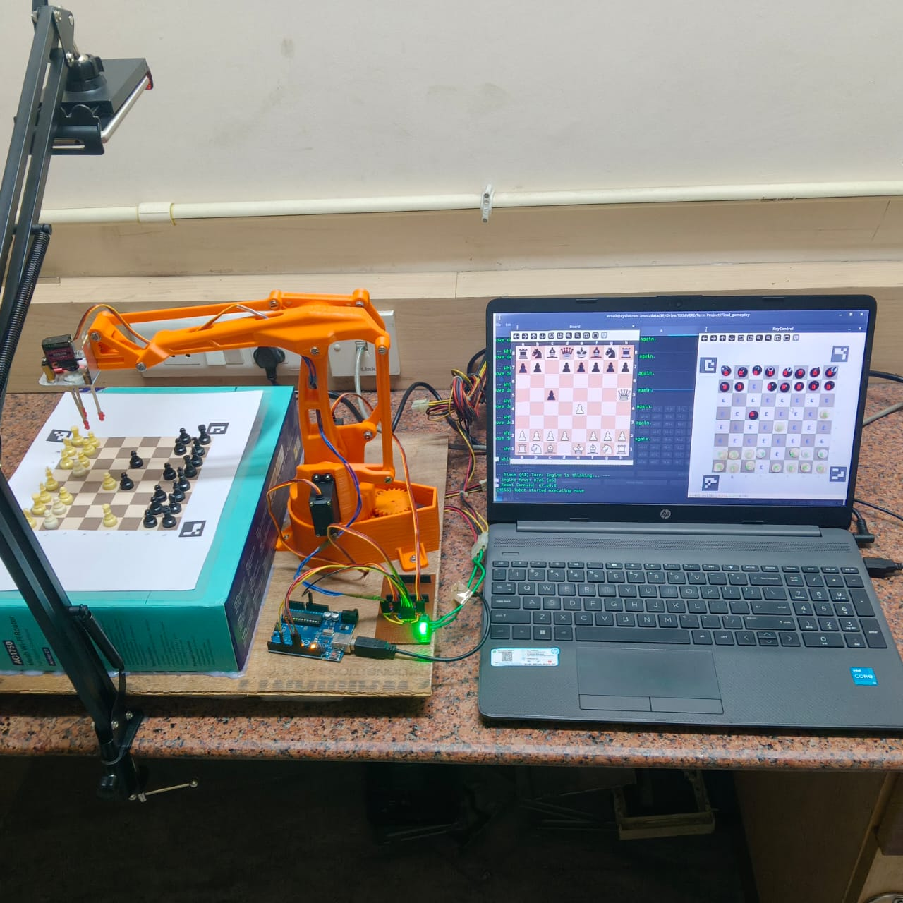

# ♟️ CheckMateBot  
## A Vision-Guided Robotic Arm for Strategic Chess Gameplay

<!-- FULL SYSTEM IMAGE -->
<p align="center">
  
</p>

**CheckMateBot** is an end-to-end **Physical AI system** that autonomously plays chess on a **real physical chessboard** using **computer vision, classical AI, and robotics**.

It combines:
- Real-time visual perception  
- Intelligent game reasoning  
- Precise robotic manipulation  

to bridge the gap between **digital intelligence and physical action**.

---

## 🎯 Motivation

Building a robot capable of playing chess in the real world is a challenging benchmark for **human-robot interaction**, **perception**, and **dexterous manipulation**.

Robotics today is transforming industries such as **manufacturing, healthcare, and logistics**, driven by advances in **AI, vision, and autonomy**. Systems like Boston Dynamics’ *Atlas* and Unitree’s *G1* demonstrate how perception and decision-making can be embodied in machines.

**CheckMateBot** explores these same principles at a smaller but highly complex scale — a physical chessboard — where even millimetric errors matter.

---

## 🧠 Project Objective

To develop an **autonomous chess-playing robotic system** capable of:

- Real-time board perception  
- Accurate human move detection  
- AI-based strategic response  
- Precise robotic pick-and-place execution  
- Human-supervised interaction  

---

## 🧩 System Overview

CheckMateBot is composed of three tightly integrated modules:

### 👁️ The Vision  
Understands the physical chessboard

### 🧠 The Brain  
Computes the best chess move

### 🦾 The Arm  
Executes moves on the real board

Together, they form a **closed-loop perception → decision → action system**.

---

## 🏗️ System Architecture

**Execution Flow:**

1. A **live camera** captures the chessboard
2. Computer vision reconstructs the board state
3. Moves are inferred and validated
4. **Stockfish** computes the optimal response
5. High-level moves are translated to robot commands
6. The robotic arm executes the move physically

Human interaction occurs through a **main computer interface**, enabling supervision and manual override.

---

## 👁️ Gameplay: The Vision

### Board Perception Pipeline
- Camera mounted for a fixed top-down view
- **ArUco markers** used for calibration and perspective correction
- Homography-based warping for perfect board alignment
- Board segmented into **64 individual cells**

### Cell Processing
Each cell undergoes:
- Cropping to **64 × 64 pixels**
- **CLAHE** normalization for lighting robustness
- Data augmentation for generalization

### Machine Learning (SVM Pipeline)
A **two-stage SVM classifier** is used:

1. **Empty vs Occupied**  
   - Dataset: 8,832 images  
2. **Black vs White**  
   - Dataset: 3,072 images  

📈 Achieved **100% accuracy** on held-out test sets.

### Output
An **8 × 8 Ternary Occupancy Map**:
```
0 → Empty
1 → White piece
2 → Black piece
```

---

## 🧠 Gameplay: The Brain

Strategic decision-making is handled by **Stockfish**, a powerful open-source chess engine.

### Key Concepts:
- Board state represented using **FEN**
- Communication via **UCI (Universal Chess Interface)**
- Time-bounded search for real-time response

The system validates detected human moves and computes the best counter-move.

---

## 🦾 Gameplay: The Arm

### Robotic Arm
- **EezyBot Mk II**  
- 3-DOF serial manipulator  
- 3D-printed structure  
- MG996R and MG90S servo motors  

### Control Strategy
A **multi-level translation pipeline**:
1. High-level move (e.g., `c7 → c5`)
2. Converted to structured commands
3. Mapped to joint angles via lookup tables
4. Executed by **Arduino / ESP32**

### Execution Modes
- **Autonomous mode**
- **Manual (human-assisted) mode**

---

## 💡 Key Innovations

- **Three-finger concentric gripper** inspired by OnRobot 3FG15  
- Dual robot control modes (autonomous + manual)
- Custom **ML-based data collection application**
- Decoupled vision, AI, and control architecture

---

## ⚠️ Challenges Faced

- Lighting sensitivity affecting move detection  
- Mechanical backlash and joint tolerance  
- Servo jitter and jerky motion  
- Calibration error accumulation  
- Limited work envelope of the arm  

---

## 🚧 Current Limitations

- Wrong lighting → wrong move detection  
- Slow and shaky arm motion  
- Limited gripping precision  
- Small workspace  

---

## 🔮 Next Steps

- Add support for castling, promotion, and captures  
- Improve vision robustness  
- Introduce **Reinforcement Learning** for motion smoothing  
- Upgrade actuators for precision control  
- Reduce servo jitter through motion smoothing  
- Add **PGN tracking** and automated game analysis  

---

## 🛠️ Tools & Technologies

**Software**
- Python, OpenCV
- Scikit-learn (SVM)
- Stockfish
- python-chess
- Arduino IDE

**Hardware**
- Arduino / ESP32
- Servo motors (MG996R, MG90S)
- 3D-printed robotic arm
- Camera (mobile + stand)

---

## 📌 Summary

**CheckMateBot** is a complete **vision-guided robotic system** that demonstrates how **perception, intelligence, and physical manipulation** can be integrated into a single autonomous agent.

It serves as a strong foundation for future work in **robotic manipulation, Physical AI, and learning-based control**.

---

> *From pixels → to strategy → to precise physical motion.*

---

## 👨‍💻 Author

[**Arnab Singha**](https://arnabsingha200228.github.io/), *Computer Science department*, [RKMVERI](https://rkmvu.ac.in/).

---
